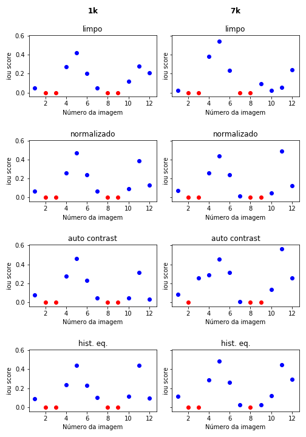

# Semi-Automatic Segmentation model testing
Test models and image pre-processing techniques to find the best combination.

## Usage
1. Define the `WORK_DIR` with the working directory of your project. It should contain:
   1. File named `dataset.zip` containing:
      * `input` folder with all the input images
      * `label` folder with all the target images (masks) with the same name as in the input folder
      * `test-input` folder with the test input images
      * `test-label` folder with the target test masks with the same name as in the input folder
    2. Folder named `models`
2. Define `SIZE` with the model input size (SegNet follows 256)
3. Define `STRIDE` with the stride that the algorithm will make to generate the dataset
4. Define the `CURRENT_MODEL` with the path of your model according to [image-segmentation-keras](https://github.com/divamgupta/image-segmentation-keras)
   * `CURRENT_MODEL = "segnet.resnet50_segnet"` will produce a SegNet model using the ResNet50 backbone
5. Run all the cells until `Functions` stage
6. If your model is new (first time using it)
   1. Run `create_default_model()`
7. If your dataset is new (first time using it)
   1. Run `develop_dataset()` (last cell)
   2. Wait for it to complete, may take a while
8. Create/modificate the image pre-processing cells, starting at `Standard`
9. Run the cells
    * When a cell is completed, it should create a folder with the model results
10. At the end, run `fetch_model_results()` to get all the model results into its own folder

## Analysing data
1. Copy the *CURRENT_MODEL*.csv file to the same dir as `data_analysis.ipynb`
2. Run the cells
3. Check the result.png file

## Example
On the right there's the model trained on 1024 images and on the left there's the model results trained on 7000 images.
Each line corresponds to a different image processing technique.

